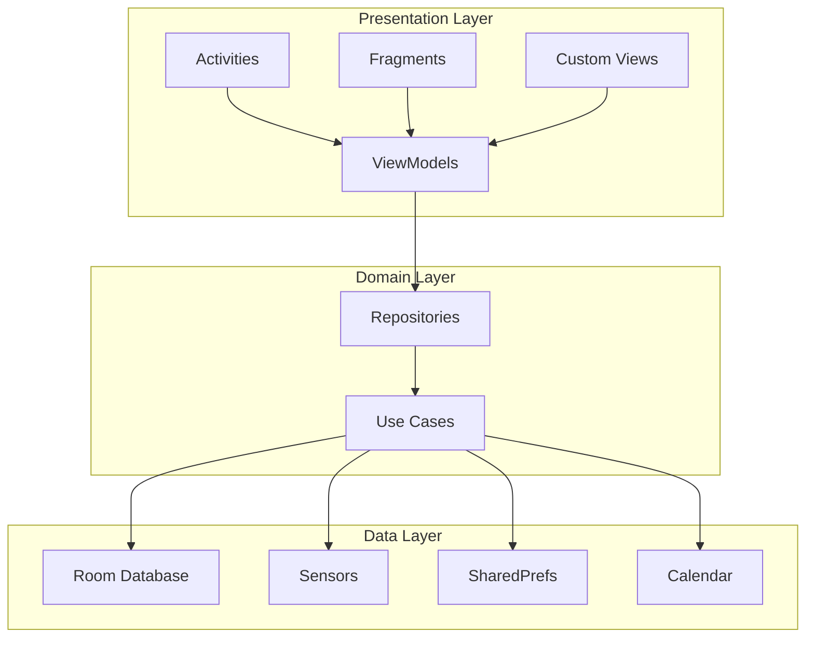

# 🧠 MindBricks

<p align="center">
  
</p>

<p align="center">
  <strong>An intelligent study companion that helps you build better study habits, one brick at a time.</strong>
</p>

<p align="center">
  
  
  
  
  
</p>

---

## 📖 Table of Contents

- [Overview](#-overview)
- [Features](#-features)
- [Screenshots](#-screenshots)
- [Architecture](#-architecture)
- [Tech Stack](#-tech-stack)
- [Getting Started](#-getting-started)
- [Development Setup](#-development-setup)
- [Project Structure](#-project-structure)
- [Key Components](#-key-components)
- [Database Schema](#-database-schema)
- [Building the Project](#-building-the-project)
- [License](#-license)

---

## 🎯 Overview

MindBricks is a comprehensive Android study-tracking platform designed to optimize learning for students and professionals. By integrating the Pomodoro technique with sensor-based focus tracking and post-session self-assessments, the app builds a deep understanding of user productivity. These insights power a personalized study timeline that adapts to individual habits, leveraging intelligent analytics and gamification to maximize focus and drive consistent academic growth.

---

## ✨ Features

### 🌟 Key Features at a Glance

| Feature | Description |
| :--- | :--- |
| 🍅 **Smart Timer** | Flexible **Pomodoro timer** with custom work/break intervals and subject tagging. |
| 📡 **Focus Sensing** | Real-time monitoring of **noise, light, and motion** to ensure optimal study conditions. |
| 📊 **Deep Analytics** | Visual insights with **7+ chart types**, heatmaps, and weekly focus trends. |
| 🏙️ **Gamification** | Build a **virtual city** with coins earned from productive study sessions. |
| 🤖 **AI Planner** | Smart **daily schedule recommendations** based on your habits and calendar. |

<details>
<summary><strong>Click to expand detailed feature breakdown</strong></summary>

### 🔍 Detailed Feature Breakdown

#### **Smart Study Timer**
- **Pomodoro Technique Integration**: Configurable work/break intervals with customizable durations
- **Multiple Timer Modes**: Short break (5-10 min), long break (15-30 min), and focus session (25-60 min)
- **Session Tags**: Organize study sessions by subject/topic with custom color-coded tags
- **Real-time Coin Rewards**: Earn in-app currency for completing study sessions
- **Session History**: Complete chronological record of all study sessions with detailed statistics

#### **Advanced Focus Monitoring**
- **Multi-Sensor Tracking**: Real-time monitoring during study sessions using:
  - **Microphone**: Ambient noise level detection (background noise monitoring)
  - **Light Sensor**: Environmental lighting conditions
  - **Accelerometer**: Device orientation (kill-switch for light sensor when face-down) and movement detection
  - **Significant Motion Sensor**: Major movement detection (distraction tracking) with accelerometer fallback
- **Foreground Service**: Continuous sensor monitoring even when screen is off (with WakeLock optimization)
- **Session Quality Metrics**: Automatic calculation of focus scores based on sensor data
- **Privacy-First Design**: All sensor data is processed locally and stored only as aggregated statistics

#### **Intelligent Analytics Dashboard**
- **Weekly Focus Chart**: Bar chart showing daily study time over the past 7 days
- **Hourly Distribution Heatmap**: Visualize your most productive hours of the day
- **Quality Heatmap**: Color-coded calendar showing focus quality for each study session
- **Tag Usage Pie Chart**: Distribution of study time across different subjects/tags
- **Daily Goal Rings**: Apple Watch-style activity rings showing daily progress
- **Streak Calendar**: Visual representation of study streaks with color intensity
- **Daily Timeline**: Detailed hour-by-hour breakdown of study sessions
- **Session History List**: Expandable cards with detailed session information including:
  - Duration and timestamps
  - Perceived productivity rating
  - Emotional state (PAM - Pleasure, Arousal, Dominance model)
  - Focus score calculated from sensor data
  - Environmental conditions (noise level, light, movement)

#### **Personalized Recommendations**
- **Adaptive Daily Schedule**: AI-powered schedule generation based on:
  - Your study preferences and goals
  - Historical performance data
  - Calendar integration
  - Optimal study time allocation
- **Calendar Integration**: Syncs with device calendar to avoid scheduling conflicts
- **Context-Aware Suggestions**: Recommendations consider:
  - Sleep schedule preferences
  - Meal times
  - Work schedule
  - Exercise routine
  - Social time
  - Daily study hour goals
- **Visual Schedule Display**: Interactive 24-hour timeline with activity blocks
- **Study Plan Customization**: Set daily study goals for each day of the week

#### **Gamification System**
- **Coin Economy**: Earn coins by completing study sessions
- **City Building Mini-Game**: 
  - Build and customize your own virtual city
  - Purchase tiles (buildings, parks, roads, decorations) from the shop
  - 40x40 grid world for extensive city building
  - Drag-and-drop tile placement system
  - Multiple tile categories: terrain, buildings, nature, infrastructure
  - Persistent world state saved locally
  - Inventory management system
  - Categorized shop with preview images
- **Visual Progress**: Watch your city grow as you maintain study habits

#### **User Profile & Customization**
- **Profile Picture**: Choose from gallery or take a photo with camera
- **Study Objectives**: Set and track your learning goals
- **Customizable Tags**: Create unlimited subject/topic tags with custom colors
- **Theme Support**: Material Design 3 with system theme support
- **Avatar Generation**: Automatic avatar generation via API integration

#### **Post-Session Evaluation**
- **Emotion Assessment**: PAM (Pleasure-Arousal-Dominance) model questionnaire
- **Productivity Rating**: Multi-dimensional perceived productivity questions:
  - Overall accomplishment
  - Task progression
  - Focus level
  - Efficiency perception
  - Session satisfaction
- **Focus Score Calculation**: Automatic scoring based on sensor data
- **Historical Comparison**: Compare current session with personal averages

#### **Calendar Integration**
- **Device Calendar Sync**: Read calendar events for intelligent scheduling
- **Conflict Detection**: Avoid scheduling study sessions during existing events
- **Permission Management**: Granular calendar permission requests
- **Event Display**: Shows calendar events in recommendation timeline

#### **Settings & Preferences**
- **Profile Management**: Update name, avatar, and study objectives
- **Pomodoro Configuration**: Customize timer durations for all modes
- **Study Plan Editor**: Set daily study hour goals for each weekday
- **Calendar Settings**: Manage calendar sync and permissions
- **Debug Tools** (Debug builds only): 
  - Test data generation
  - Database inspection
  - Development utilities

#### **Onboarding Experience**
- **Multi-Step Setup**: Guided introduction to app features
- **Permission Requests**: Contextual explanation for each permission
- **User Profile Creation**: Set up name and avatar during onboarding
- **Sensor Testing**: Verify sensor availability and functionality
- **Skip Option**: Fast-track for experienced users

</details>

### 🔒 Privacy & Permissions

MindBricks requires the following permissions:
- **Microphone** (`RECORD_AUDIO`): Record ambient noise levels during sessions (processed locally)
- **Activity Recognition** (`ACTIVITY_RECOGNITION`): Detect significant device movement
- **Camera** (`CAMERA`): Take profile pictures
- **Gallery** (`READ_MEDIA_IMAGES`): Select profile pictures from gallery
- **Calendar** (`READ_CALENDAR`): Sync calendar events for recommendations (optional)
- **Notifications** (`POST_NOTIFICATIONS`): Session reminders and completion alerts
- **Internet** (`INTERNET`): Avatar generation API only
- **Vibration** (`VIBRATE`): Haptic feedback for timer events
- **Wake Lock** (`WAKE_LOCK`): Keep sensors active during study sessions

### 🛡️ Data Privacy & Ethical Considerations
MindBricks handles sensitive behavioral data (study habits, environmental conditions, location context). To ensure user privacy and **GDPR compliance**:
- **Local-Only Storage**: All sensor data and questionnaire responses are processed and stored strictly on the device using Room Database.
- **No Cloud Upload**: We do not transmit any personal data to external servers.
- **Data Control**: Users have full ownership of their data with options to delete it at any time.
- **Aggregated Statistics**: Raw sensor streams (like audio) are processed in real-time to extract features (e.g., "noise level") and are never stored raw.

---

## 📱 Screenshots

### 🏠 Home Screen - Study Timer
<p align="center">
  
</p>

*Pomodoro timer with tag selection, coin balance, and session tracking dots*

---

### 🎓 Onboarding Flow - First-Time Setup

<p align="center">
  
  
</p>

*Left: Welcome introduction screen | Right: User profile creation with name and avatar*

<p align="center">
  
  
</p>

*Left: Sensor permissions explanation and testing | Right: Notification permission request*

---

### 📊 Analytics - Overview Tab

<p align="center">
  
  
</p>

*Left: AI-powered daily schedule with calendar integration | Right: Study streak calendar with quality indicators*

---

### 📈 Analytics - Insights Tab

<p align="center">
  
  
</p>

*Left: Weekly focus bar chart showing daily study time | Right: Hourly distribution heatmap*

<p align="center">
  
  
</p>

*Left: Focus quality heatmap calendar | Right: Tag usage pie chart showing subject distribution*

---

### 📜 Analytics - History Tab

<p align="center">
  
</p>

*Detailed session history with expandable cards showing focus scores, duration, and statistics*

---

### ⚙️ Settings - Profile & Configuration

<p align="center">
  
  
</p>

*Left: User profile with avatar and study objectives | Right: Pomodoro timer configuration*

<p align="center">
  
  
</p>

*Left: Weekly study plan editor | Right: Calendar integration settings*

---

### 🏪 Shop - City Building Game

<p align="center">
  
  
</p>

*Left: 40x40 tile-based city world with placed buildings | Right: Editing mode with tile placement*

<p align="center">
  
</p>

*Tile shop with categorized items - purchase buildings, decorations, and infrastructure with earned coins*

---

### 📝 Post-Session Questionnaires

<p align="center">
  
  
</p>

*Left: PAM (Pleasure-Arousal-Dominance) emotion assessment | Right: Multi-dimensional productivity questionnaire*

---

### 🔧 Debug Menu (Development Builds Only)

<p align="center">
  
</p>

*Developer tools for testing and database inspection*

---

## 🏗️ Architecture

MindBricks follows **Clean Architecture** principles with **MVVM (Model-View-ViewModel)** pattern:



### Design Patterns Used
- **MVVM**: Separation of UI logic from business logic
- **Repository Pattern**: Abstraction layer for data sources
- **Observer Pattern**: LiveData for reactive UI updates
- **Strategy Pattern**: Sensor implementations with pluggable strategies
- **Factory Pattern**: Tile asset creation and loading
- **Singleton Pattern**: Database and manager instances
- **Service Locator**: Dependency management for ViewModels

### 🔧 Technical Challenges & Implementation Decisions

#### **Foreground vs. Background Service**
Initially designed to run in the background, we pivoted to a **Foreground Service** architecture due to Android's strict background execution limits and sensor access restrictions (particularly microphone and camera access). This ensures reliable data collection while the user studies, respecting OS constraints and preventing system kills.

#### **City Building System Architecture**
The city-building mini-game required handling complex state, assets, and logic. To maintain code quality, we refactored the monolithic game logic into **ten dedicated modules**, separating concerns:
- **City State**: Manages the grid data and persistence
- **Asset Manager**: Handles loading and caching of tile resources
- **Inventory System**: Tracks user items and purchases
- **Renderer**: specialized `Canvas` drawing logic

#### **Data Visualization & Processing**
We implemented sophisticated time-series analysis on sensor data (noise, light, motion). The system performs **Statistical Aggregation**, **Predictive Analytics**, and **Pattern Recognition** to generate the Focus Score. This score helps identify peak performance times by correlating environmental data with user-reported productivity.

---

## 🛠️ Tech Stack

### Core Technologies
- **Language**: Java 17
- **Min SDK**: Android 10 (API 29)
- **Target SDK**: Android 15 (API 36)
- **Build System**: Gradle with Kotlin DSL

### Android Jetpack Components
- **Room Database**: Local data persistence with SQLite
- **LiveData**: Observable data holder for reactive UI
- **ViewModel**: Lifecycle-aware UI-related data management
- **Navigation Component**: Fragment navigation and deep linking
- **ViewBinding & DataBinding**: Type-safe view access
- **WorkManager**: Background task scheduling (future feature)
- **Fragment KTX**: Kotlin extensions for fragments

### UI/UX Libraries
- **Material Design 3**: Latest Material components and theming
- **MPAndroidChart**: Advanced charting library for analytics
- **Glide**: Efficient image loading and caching
- **SwipeRefreshLayout**: Pull-to-refresh gesture
- **RecyclerView**: Efficient list rendering
- **ConstraintLayout**: Flexible responsive layouts
- **ViewPager2**: Swipeable onboarding screens

### Data & Serialization
- **Gson**: JSON parsing and serialization
- **Room Type Converters**: Object serialization for database

### Hardware Integration
- **SensorManager**: Access to device sensors
- **AudioRecord**: Microphone for ambient noise detection
- **CalendarProvider**: Device calendar integration
- **CameraX** (via FileProvider): Camera and gallery access

### Development Tools
- **Android Studio**: Official IDE
- **Gradle Version Catalog**: Centralized dependency management
- **ProGuard**: Code obfuscation for release builds
- **JUnit & Espresso**: Unit and UI testing frameworks

---

## 🚀 Getting Started

### Prerequisites
- **Android Studio**: Hedgehog (2023.1.1) or later
- **JDK**: Java 17 or higher
- **Android SDK**: API 29 or higher
- **Physical Device or Emulator**: API 29+ (Android 10+) for full sensor support

### Quick Start

1. **Clone the repository**
   ```bash
   git clone https://github.com/yourusername/mindbricks.git
   cd mindbricks
   ```

2. **Open in Android Studio**
   - Launch Android Studio
   - Select `File > Open`
   - Navigate to the `android` directory
   - Click `OK` to open the project

3. **Sync Gradle**
   - Android Studio will automatically prompt to sync Gradle
   - Wait for dependency download to complete

4. **Run the app**
   - Connect an Android device or start an emulator
   - Click the `Run` button or press `Shift + F10`
   - Select your target device

---

## 💻 Development Setup

> **Note**: For detailed workflows, debugging tips, and common issues, please refer to the **[Development Guide](docs/DEVELOPMENT.md)**. For a quick cheat sheet, check the **[Quick Reference](docs/QUICK_REFERENCE.md)**.

### Android Studio Configuration

#### 1. Install Required SDKs
```
Tools > SDK Manager
├── Android SDK Platform 36
├── Android SDK Build-Tools 36.0.0
├── Android Emulator
└── Android SDK Platform-Tools
```

#### 2. Configure Build Variants
```
Build > Select Build Variant
├── debug: Development build with debug menu
└── release: Production build with optimizations
```

#### 3. Enable ViewBinding
ViewBinding is enabled by default in `build.gradle.kts`:
```kotlin
buildFeatures {
    viewBinding = true
    dataBinding = true
}
```

### Building the Project

#### Debug Build
```bash
cd android
./gradlew assembleDebug
```
Output: `app/build/outputs/apk/debug/app-debug.apk`

#### Release Build
```bash
cd android
./gradlew assembleRelease
```
Output: `app/build/outputs/apk/release/app-release.apk`

#### Run Tests
```bash
# Unit tests
./gradlew test

# Instrumented tests
./gradlew connectedAndroidTest
```

### Code Style Guidelines

This project follows **Google Java Style Guide** with these key conventions:

- **Indentation**: 4 spaces (no tabs)
- **Line Length**: 120 characters max
- **Naming**:
  - Classes: `PascalCase`
  - Methods/Variables: `camelCase`
  - Constants: `UPPER_SNAKE_CASE`
  - Resources: `snake_case` with prefixes (`activity_`, `fragment_`, `component_`)
- **Javadoc**: All public classes and methods must have documentation
- **Author Tags**: Include `@author` tags for attribution

### Resource Naming Conventions

```
layouts/
├── activity_*.xml      # Activity layouts
├── fragment_*.xml      # Fragment layouts
├── component_*.xml     # Reusable components
├── item_*.xml          # RecyclerView items
└── dialog_*.xml        # Dialog layouts

strings/
├── strings_main.xml    # Global strings
├── strings_home.xml    # Home fragment strings
├── strings_analytics.xml
├── strings_shop.xml
└── strings_settings.xml
```

---

## 📂 Project Structure

```
mindbricks/
├── android/                      # Android application
│   ├── app/
│   │   ├── src/
│   │   │   ├── main/
│   │   │   │   ├── java/ch/inf/usi/mindbricks/
│   │   │   │   │   ├── config/             # App configuration
│   │   │   │   │   ├── database/           # Room Database & DAOs
│   │   │   │   │   ├── drivers/            # Sensor drivers
│   │   │   │   │   │   ├── base/          # Base sensor interfaces
│   │   │   │   │   │   ├── calendar/      # Calendar integration
│   │   │   │   │   │   └── motion/        # Motion sensor strategies
│   │   │   │   │   ├── game/              # City building game
│   │   │   │   │   ├── model/             # Data models & entities
│   │   │   │   │   │   ├── evaluation/   # PAM scores
│   │   │   │   │   │   ├── plan/         # Study plan models
│   │   │   │   │   │   ├── questionnare/ # Questionnaire data
│   │   │   │   │   │   ├── recommendation/# Recommendation models
│   │   │   │   │   │   └── visual/       # UI-specific models
│   │   │   │   │   ├── repository/        # Data repositories
│   │   │   │   │   ├── service/           # Foreground services
│   │   │   │   │   ├── ui/                # UI components
│   │   │   │   │   │   ├── charts/       # Custom chart views
│   │   │   │   │   │   ├── nav/          # Navigation fragments
│   │   │   │   │   │   │   ├── analytics/
│   │   │   │   │   │   │   ├── home/
│   │   │   │   │   │   │   └── shop/
│   │   │   │   │   │   ├── onboarding/   # Onboarding flow
│   │   │   │   │   │   └── settings/     # Settings screens
│   │   │   │   │   └── util/              # Utility classes
│   │   │   │   │       ├── analytics/    # Analytics helpers
│   │   │   │   │       ├── database/     # DB utilities
│   │   │   │   │       ├── evaluation/   # Recommendation engine
│   │   │   │   │       ├── questionnaire/# Questionnaire logic
│   │   │   │   │       └── validators/   # Input validation
│   │   │   │   ├── res/
│   │   │   │   │   ├── drawable/         # Vector graphics
│   │   │   │   │   ├── layout/           # XML layouts
│   │   │   │   │   ├── mipmap/           # App icons
│   │   │   │   │   ├── navigation/       # Navigation graphs
│   │   │   │   │   ├── raw/              # Sound files
│   │   │   │   │   ├── values/           # Strings, colors, themes
│   │   │   │   │   └── xml/              # Preferences, file paths
│   │   │   │   └── AndroidManifest.xml
│   │   │   └── test/                     # Unit tests
│   │   ├── schemas/                      # Room database schemas
│   │   └── build.gradle.kts
│   ├── build.gradle.kts
│   └── settings.gradle.kts
├── assets/                               # Project assets
├── docs/                                 # Documentation
│   ├── final_report/                    # LaTeX final report
│   └── project_proposal.pdf
├── slides/                              # Presentation slides
└── README.md
```

---

## 🔑 Key Components

### Core Activities
- **`LauncherActivity`**: Splash screen and onboarding check
- **`MainActivity`**: Main navigation host with bottom navigation bar
- **`OnboardingActivity`**: Multi-step user onboarding flow
- **`SettingsActivity`**: Hierarchical settings with multiple fragments

### Main Fragments
- **`HomeFragment`**: Study timer with Pomodoro controls
- **`AnalyticsFragment`**: Comprehensive analytics dashboard
- **`ShopFragment`**: City building game and tile shop

### ViewModels
- **`HomeViewModel`**: Manages study session state and timers
- **`AnalyticsViewModel`**: Aggregates and processes study statistics
- **`ProfileViewModel`**: User profile and coin balance management
- **`TileGameViewModel`**: City building game state

### Database Layer
- **`AppDatabase`**: Room database singleton with 7 tables
- **`StudySessionDao`**: CRUD operations for study sessions
- **`TagDao`**: Tag management queries
- **`PAMScoreDao`**: Emotion assessment storage
- **`SessionQuestionnaireDao`**: Productivity questionnaire responses
- **`SessionSensorLogDao`**: Sensor data logs
- **`CalendarEventDao`**: Calendar sync cache

### Sensors & Drivers
- **`SensorService`**: Foreground service for continuous monitoring
- **`MicrophoneRecorder`**: Ambient noise level detection
- **`LightSensor`**: Environmental lighting monitoring
- **`AccelerometerSensor`**: Device orientation tracking
- **`SignificantMotionSensor`**: Major movement detection
- **`BaseSensor`**: Abstract sensor interface

### Utilities
- **`RecommendationEngine`**: AI-powered schedule generation
- **`FocusScoreCalculator`**: Sensor data analysis
- **`PreferencesManager`**: SharedPreferences wrapper
- **`UserPreferenceLoader`**: JSON-based preference loading
- **`TagManager`**: Tag CRUD operations
- **`NotificationHelper`**: Notification creation and management
- **`SoundPlayer`**: Audio feedback for timers
- **`VibrationHelper`**: Haptic feedback wrapper

### Custom Views
- **`GoalRingsView`**: Circular progress rings (Apple Watch style)
- **`WeeklyFocusChartView`**: Bar chart for weekly overview
- **`HourlyDistributionChartView`**: Heatmap for hourly patterns
- **`QualityHeatmapChartView`**: Calendar heatmap for session quality
- **`StreakCalendarView`**: Streak visualization calendar
- **`TagUsageChartView`**: Pie chart for tag distribution
- **`DailyTimelineChartView`**: Horizontal timeline chart
- **`CityView`**: Custom canvas-based tile world renderer

---

## 🗄️ Database Schema

MindBricks uses **Room Database** with the following tables:

### `study_sessions`
Primary table for study session records.
```sql
CREATE TABLE study_sessions (
    id INTEGER PRIMARY KEY AUTOINCREMENT,
    tag_id INTEGER NOT NULL,
    start_time INTEGER NOT NULL,
    end_time INTEGER,
    duration_seconds INTEGER,
    coins_earned INTEGER DEFAULT 0,
    focus_score REAL,
    FOREIGN KEY (tag_id) REFERENCES tags(id) ON DELETE CASCADE
)
```

### `tags`
Subject/topic categorization.
```sql
CREATE TABLE tags (
    id INTEGER PRIMARY KEY AUTOINCREMENT,
    name TEXT NOT NULL UNIQUE,
    color TEXT NOT NULL,
    created_at INTEGER NOT NULL
)
```

### `session_questionnaires`
Post-session evaluations.
```sql
CREATE TABLE session_questionnaires (
    id INTEGER PRIMARY KEY AUTOINCREMENT,
    session_id INTEGER NOT NULL,
    accomplishment INTEGER NOT NULL,
    task_progression INTEGER NOT NULL,
    focus_level INTEGER NOT NULL,
    efficiency INTEGER NOT NULL,
    satisfaction INTEGER NOT NULL,
    average_score REAL NOT NULL,
    FOREIGN KEY (session_id) REFERENCES study_sessions(id) ON DELETE CASCADE
)
```

### `pam_scores`
PAM (Pleasure-Arousal-Dominance) emotional assessment.
```sql
CREATE TABLE pam_scores (
    id INTEGER PRIMARY KEY AUTOINCREMENT,
    session_id INTEGER NOT NULL,
    pleasure INTEGER NOT NULL,
    arousal INTEGER NOT NULL,
    dominance INTEGER NOT NULL,
    created_at INTEGER NOT NULL,
    FOREIGN KEY (session_id) REFERENCES study_sessions(id) ON DELETE CASCADE
)
```

### `session_sensor_logs`
Aggregated sensor readings during sessions.
```sql
CREATE TABLE session_sensor_logs (
    id INTEGER PRIMARY KEY AUTOINCREMENT,
    session_id INTEGER NOT NULL,
    timestamp INTEGER NOT NULL,
    light_level REAL NOT NULL,
    noise_level REAL NOT NULL,
    device_face_up INTEGER NOT NULL,
    motion_detected INTEGER NOT NULL,
    FOREIGN KEY (session_id) REFERENCES study_sessions(id) ON DELETE CASCADE
)
```

### `calendar_events`
Cached calendar events for recommendations.
```sql
CREATE TABLE calendar_events (
    id INTEGER PRIMARY KEY AUTOINCREMENT,
    calendar_id INTEGER NOT NULL,
    event_id INTEGER NOT NULL,
    title TEXT,
    start_time INTEGER NOT NULL,
    end_time INTEGER NOT NULL,
    all_day INTEGER NOT NULL,
    synced_at INTEGER NOT NULL
)
```

### Relationships
```
tags (1) ──< (N) study_sessions
study_sessions (1) ──< (1) session_questionnaires
study_sessions (1) ──< (1) pam_scores
study_sessions (1) ──< (N) session_sensor_logs
```

---

## 🔨 Building the Project

### Command Line Build

#### Prerequisites
```bash
# Verify Java version
java -version  # Should be Java 17+

# Verify Android SDK
echo $ANDROID_HOME  # Should point to Android SDK location
```

#### Build Commands
```bash
# Navigate to Android project
cd android

# Clean build
./gradlew clean

# Build debug APK
./gradlew assembleDebug

# Build release APK
./gradlew assembleRelease

# Install debug on connected device
./gradlew installDebug

# Run all checks and tests
./gradlew check

# Generate code coverage report
./gradlew jacocoTestReport
```

### Android Studio Build

1. **Open Project**: `File > Open` → Select `android` directory
2. **Build Menu**:
   - `Build > Clean Project`
   - `Build > Rebuild Project`
   - `Build > Make Project` (Ctrl+F9 / ⌘F9)
3. **Generate APK**: `Build > Build Bundle(s) / APK(s) > Build APK(s)`
4. **Run**: Click ▶ button or press Shift+F10

### Release Build Configuration

For production builds, configure signing in `local.properties`:
```properties
storeFile=path/to/keystore.jks
storePassword=****
keyAlias=****
keyPassword=****
```

Then build:
```bash
./gradlew assembleRelease
```

## 📄 License

This project is licensed under the MIT License - see the LICENSE file for details.

---

## 🙏 Final Notes

MindBricks represents two months of dedicated development, combining theoretical knowledge with practical Android development skills. The project demonstrates:

- ✅ Clean architecture with separation of concerns
- ✅ Modern Android development best practices
- ✅ Comprehensive sensor integration
- ✅ Advanced database design with Room
- ✅ Custom view implementations
- ✅ Material Design 3 compliance
- ✅ Extensive code documentation
- ✅ Robust error handling
- ✅ Performance optimizations

We hope MindBricks serves as a valuable reference for Android development and helps students build better study habits!

**Happy Studying! 🎓**
